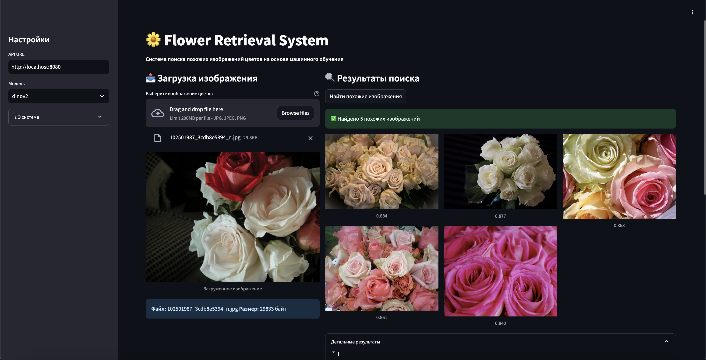

# 🌼 Flower Retrieval System

Система поиска наиболее похожих изображений цветов на основе машинного обучения.

---

## Результаты экспериментов

| Подход                  | ResNet50 | EfficientNet-B0 | CLIP (zero-shot) | CLIP (fine-tuned) | Metric Learning | DINOv2 |
|-------------------------|---------:|----------------:|-----------------:|------------------:|----------------:|--------:|
| **Метод поиска**        | FAISS Flat | FAISS Flat    | FAISS Flat       | FAISS Flat        | FAISS Flat      | FAISS Flat |
| **Precision@5**         | 0.926    | 0.938           | 0.548            | 0.331             | 0.903               | 0.974   |
| **mAP@5**               | 0.826    | 0.895           | 0.279            | 0.238             | 0.835           | 0.869   |

> *Метрики рассчитаны на тестовой части Flowers Recognition (≈800×5 изображений). «–» означает отсутствие Precision@5 для Metric Learning.*

---

## Локальный запуск

1. **Клонировать репозиторий**  
   ```bash
   git clone <repo_url>
   cd <repo_folder>
   ```
2. Cкачать датасет с kaggle и положить в flowers все 5 папок классов

3. Скачать веса и пути: https://drive.google.com/drive/folders/1GFZ-g1qytLQ6ay2uXyP8ByrHG4T9dR0B?usp=sharing
   И положить папку models в корень

2. **Создать и активировать виртуальное окружение**  
   ```bash
   python3 -m venv venv
   source venv/bin/activate
   ```

3. **Установить зависимости**  
   ```bash
   pip install -r requirements.txt
   ```

4. **Запустить API (FastAPI + Uvicorn)**  
   ```bash
   python3 -m app.main
   ```
   API будет доступно по адресу http://localhost:8080

5. **Запустить веб-интерфейс (Streamlit)**  
   ```bash
   streamlit run improved_streamlit.py        --server.port 8501        --server.address 0.0.0.0
   ```
   Открыть веб-интерфейс: http://localhost:8501
На UI может первый раз выдать нехватку времени при запуске поиска не успел пофиксить повторно нажать
Лучшие модели: DINO, METRIC
---

## Запуск через Docker

1. **Собрать и поднять контейнеры**  
   ```bash
   docker-compose up --build -d
   ```

2. **Проверить сервисы**  
   - API: http://localhost:8080/models  
   - UI:  http://localhost:8501  

На докере на UI может первый раз выдать нехватку времени при запуске поиска не успел пофиксить
Попробуйте также переключиться на Metric и обратно оно просто долго загружает еще веса dino в частности чуть подождать/пару раз нажать возможно придется потом хорошо будет работать
---

## Структура проекта

```
.
├── app/
│   ├── main.py         # REST API (FastAPI)
│   ├── registry.py     # загрузка моделей и индексов
│   └── utils.py        # вспомогательные функции
├── src/
│   ├── extractors.py   # классы для извлечения эмбеддингов
│   └── mixin.py        # общие миксины для fine-tune
├── models/             # артефакты: индексы, веса, пути, meta
├── improved_streamlit.py  # веб-интерфейс (Streamlit)
├── exper.ipynb       # ноутбук
├── longstoryshort.docx #что как пробовал фулстори тествого читать!!!
├── config.yaml        # конфигурация
├── requirements.txt   # зависимости Python
├── Dockerfile         # сборка Docker-образа
├── docker-compose.yml # настройка Docker Compose
└── README.md          # документация
```

---

##  API Endpoints

- **GET /models**  
  Возвращает список доступных моделей.  
  **Пример ответа**:
  ```json
  { "models": ["resnet50","efficientnet_b0","dinov2", "metric"] }
  ```

- **POST /predict?model={model_name}**  
  Ищет top-5 похожих изображений.  
  - **file** (multipart/form-data): изображение  
  - **model** (query): имя модели из `/models`

  **Успех (200)**:
  ```json
  {
    "model": "resnet50",
    "results": [
      { "image_path": "flowers/rose/img1.jpg", "similarity": 0.983 }
    ]
  }
  ```
  **Ошибки**:  
  - 404 — неизвестная модель  
  - 500 — внутренняя ошибка сервера

---

---

## Особенности реализации

- **FastAPI** + **Uvicorn** для REST API  
- **Streamlit** для веб-интерфейса  
- **FAISS** (Flat/IP) для быстрого поиска по векторам  
- Поддержка моделей: ResNet50, EfficientNet-B0, CLIP, Metric Learning, DINOv2  
- **Docker** + **docker-compose** для лёгкого деплоя  
- Все RNG-семена зафиксированы для воспроизводимости  

---

